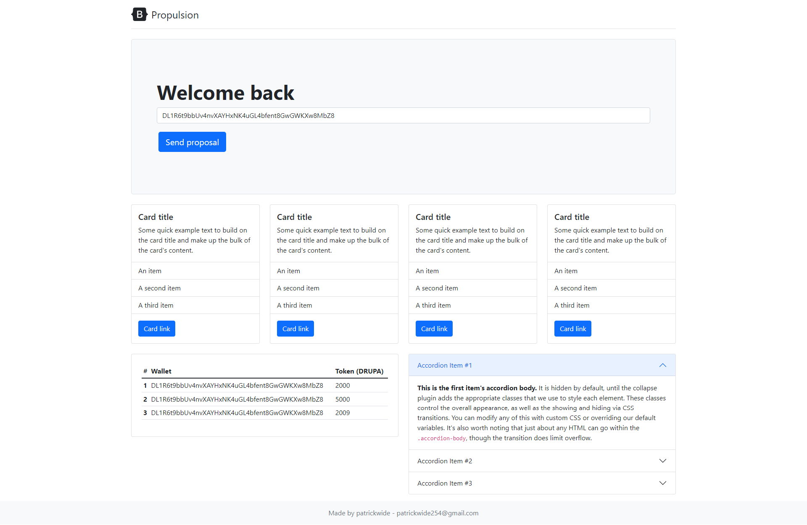

# propulsion - 2

## project overview
- The idea is to build a platform were young people can come together build and invest in project in a decentralized way (Dao)
- our mission is to break the 90 - 10 rule, were almost 100% percent of products in differnt sectors such as transport and construction is own by around 90% people

### project requrements
- rust
- anchor 
- solana cli
### how to test the project
- clone this repo
``` 
// go to the project directory
cd ./propulsion/
// install dependancy
yarn add
// build the project
anchor build
// build the project
anchor test
```
- Have fun, feel free to extend on the project 
- This is not development advice# propusion_beta
